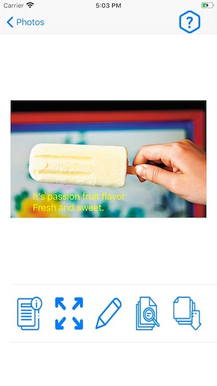

#  Albumi

## 功能介紹
Albumi是一個相片管理的相簿App，App開啟後會以CollectionView的形式列出設備裡的相片

從初始頁面點選單獨相片會進入TableView的頁面顯示這張相片以及相關功能

* 下方按鈕功能由左至右：
    1. 相片詳細資訊(建立修改時間、相片尺寸、拍攝地點)
    2. 全螢幕檢視相片
    3. 加註文字(詳見下段說明)
    4. 對比相似相片(詳見下下段說明)
    5. 另存新圖片(包含加註文字)
* 在相片上往左滑可以換到下一張、往右滑可以切回上一張

除了相簿的基本功能之外，還可以在照片上加註個人感想或是文字記錄，最後相片與文字合併儲存成新的圖片，也可以只存放加註的文字，讓使用者隨時可以修改。

儲存文字的部分使用了第三方套件FMDB

另外一個特別的功能就是可以比對出相簿裡相似的照片，這段功能是利用訓練過的Machine Learning模型，針對所有照片逐張比對出一個模型參數，再以參數過濾排列來找出相似的照片。

訓練模型時使用Apple提供的[Turi Create套件](https://github.com/apple/turicreate)

## 後續開發功能
- [ ] 相片歸類功能，暫定以Tag的形式
- [ ] 新增日文本地化介面
- [ ] MVC架構轉成MVVM
- [ ] 拆分storyboard

- [x] 模型有點太大(244MB)，再研究看要怎麼減少空間佔用
2020.12.11修改：
iOS13的Vision框架新增了 [比較圖片之間的特徵計算出歐幾里得距離](https://heartbeat.fritz.ai/compute-image-similarity-using-computer-vision-in-ios-75b4dcdd095f) 的功能，
因此針對iOS13以上的版本實作這個方法取代原先經過CoreML模型的部分，結果是效能明顯增加，後續在放棄對iOS12的支援時就可以移除MLmodel減少App的大小
